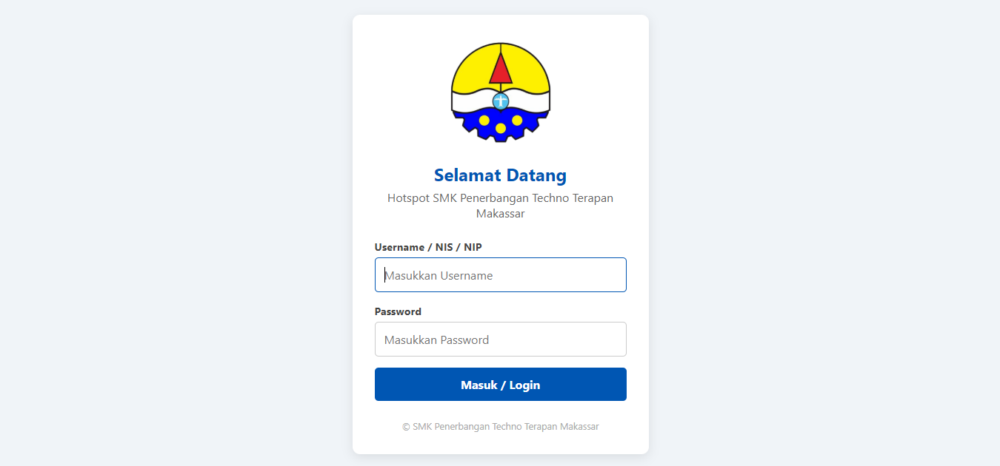
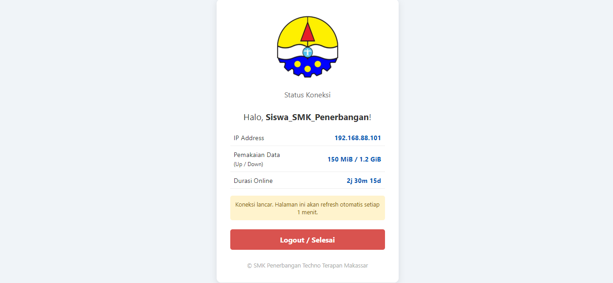
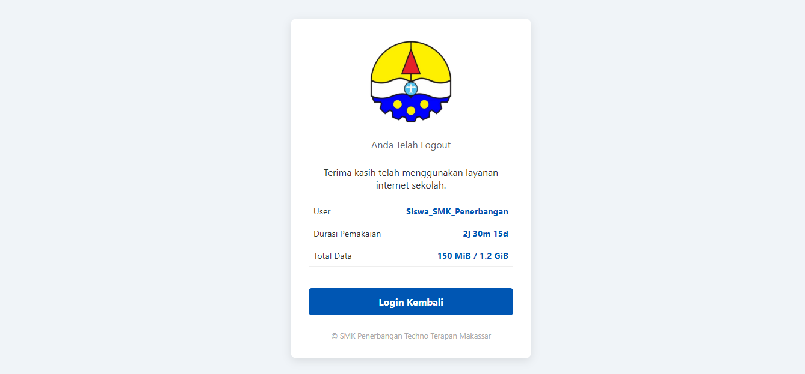

# Portal Hotspot SMK Penerbangan Techno Terapan Makassar

<!-- Badges agar terlihat Professional -->


Template Login Page Hotspot MikroTik yang responsif, ringan, dan bersih. Didesain khusus untuk lingkungan sekolah dengan pemisahan hak akses Siswa dan Guru.

## 📸 Preview Tampilan

| Halaman Login | Halaman Status (Dashboard) |
|:---:|:---:|
|  |  |
| **Tampilan Awal** | **Info Pemakaian** |

<div align="center">
  <br>
  <b>Halaman Logout</b>
</div>

---

## ✨ Fitur Utama

### 1. Halaman Login (`login.html`)
- **Responsive Design:** Tampilan otomatis menyesuaikan layar HP siswa, Tablet, maupun Laptop guru.
- **Auto-Focus:** Kursor otomatis aktif di kolom username.
- **Secure:** Info login default disembunyikan dari tampilan publik demi keamanan.

### 2. Halaman Status (`status.html`)
- **Real-time Monitoring:** Menampilkan IP, Durasi, dan Pemakaian Data.
- **Auto-Refresh:** Menyegarkan data setiap 60 detik.
- **Clean UI:** Fokus pada informasi penting tanpa gangguan iklan/teks berlebih.

---

## 📂 Struktur File

```text
Hotspot_SMKPTTM/
│
├── screenshots/            # Dokumentasi gambar untuk GitHub
│   ├── login-view.png
│   ├── status-dashboard.png
│   └── logout-screen.png
│
├── img/                    # Aset gambar untuk Website
│   └── logo-smkpttm.png
│
├── css/                    # Styling
│   └── style.css
│
├── login.html              # Halaman Utama
├── status.html             # Halaman Dashboard
├── alogin.html             # Script Redirect
├── logout.html             # Halaman Logout
└── ...
```

## 🚀 Cara Instalasi

1.  **Download:** Clone repo ini atau download ZIP.
2.  **Upload:** Masukkan semua file (kecuali folder `screenshots` dan file `.py`) ke dalam folder `hotspot` di MikroTik via WinBox/FTP.
3.  **Konfigurasi:**
    * Buat User Profile di WinBox (Limitasi Siswa vs Guru).
    * Pastikan file logo bernama `logo-smkpttm.png` ada di folder `img`.

## 🤝 Kontribusi

Silakan fork repository ini jika ingin mengembangkan fitur tambahan.

## 📄 Lisensi

Project ini dilindungi di bawah lisensi [MIT](LICENSE).
